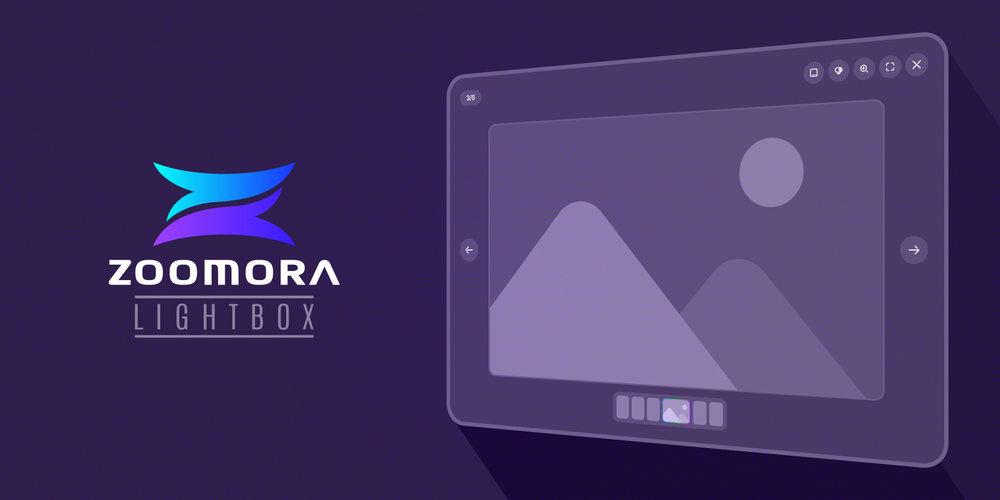

# Zoomora Lightbox



A modern, responsive lightbox plugin with zoom, fullscreen, and gallery features. Perfect for showcasing images and videos in a beautiful, user-friendly interface.

[](https://fronttheme.github.io/zoomora/)


## ✨ Features

- 🖼️ **Image Galleries** - Group multiple images together
- 🎥 **Video Support** - YouTube embeds and local video files (MP4, WebM, OGG)
- 🔍 **Smart Zoom** - Automatically detects if images are zoomable
- 🖱️ **Pan & Drag** - Navigate zoomed images with mouse/touch
- 📱 **Fully Responsive** - Works seamlessly on all devices
- ⌨️ **Keyboard Navigation** - Arrow keys, Escape, and shortcut keys
- 🎬 **Smooth Animations** - Fade and slide transition effects
- 🖼️ **Thumbnail Strip** - Quick navigation between gallery items
- 🎯 **Auto-Hide Controls** - Distraction-free viewing mode
- 🌓 **Fullscreen Mode** - Immersive viewing experience
- 🎨 **Customizable** - Extensive options and callbacks
- ♿ **Accessible** - Keyboard and screen reader friendly
- 🚀 **Lightweight** - No dependencies required
- 🔧 **Easy Integration** - Works with vanilla JS, React, Vue, etc.

## 📦 Installation

### NPM

```bash
npm install zoomora
```

### CDN

```html
<!-- CSS -->
<link rel="stylesheet" href="https://cdn.jsdelivr.net/npm/zoomora/dist/zoomora.css">

<!-- JavaScript -->
<script src="https://cdn.jsdelivr.net/npm/zoomora/dist/zoomora.umd.min.js"></script>
```

### Manual Download

Download the latest release from [GitHub Releases](https://github.com/fronttheme/zoomora/releases) and include the files in your project:

```html
<link rel="stylesheet" href="path/to/zoomora.css">
<script src="path/to/zoomora.umd.min.js"></script>
```

## 🚀 Quick Start

### Basic Usage

```html
<!-- Add data-zoomora attribute with a unique group ID -->


<!-- Initialize (auto-initializes if elements exist) -->
<script>
  new Zoomora();
</script>
```

### With Custom Options

```javascript
const lightbox = new Zoomora({
  selector: '[data-zoomora]',
  showCounter: true,
  showThumbnails: true,
  showFullscreen: true,
  showZoom: true,
  transition: 'fade', // 'fade' or 'slide'
  maxZoomScale: 3,
  animationDuration: 300,
  autoHideDelay: 3000,
  autoHideEnabled: false,
  onOpen: (element, index) => {
    console.log('Lightbox opened', element, index);
  },
  onClose: (index) => {
    console.log('Lightbox closed', index);
  }
});
```

## 📖 Usage Examples

### Image Gallery

```html
<div class="gallery">
  
  
  
</div>
```

### Video Support

#### Local Video
```html

```

#### YouTube Video
```html

```

YouTube short URLs also work:
```html
data-src="https://youtu.be/VIDEO_ID"
```

### Single Image

```html

```

### Using with Anchor Tags

```javascript
// Initialize with href attribute instead of data-src
const lightbox = Zoomora.bind('a[data-lightbox]', {
  useHref: true
});
```

```html
<a href="full-image.jpg" data-lightbox="gallery">
  
</a>
```

## ⚙️ Configuration Options

| Option | Type | Default | Description |
|--------|------|---------|-------------|
| `selector` | String | `'[data-zoomora]'` | CSS selector for lightbox triggers |
| `showCounter` | Boolean | `true` | Show image counter (1 / 5) |
| `showThumbnails` | Boolean | `true` | Show thumbnail navigation |
| `showFullscreen` | Boolean | `true` | Show fullscreen button |
| `showZoom` | Boolean | `true` | Show zoom button |
| `transition` | String | `'fade'` | Transition effect: 'fade' or 'slide' |
| `useHref` | Boolean | `false` | Use href instead of data-src |
| `maxZoomScale` | Number | `3` | Maximum zoom scale |
| `zoomStep` | Number | `0.1` | Zoom step for scroll wheel |
| `animationDuration` | Number | `300` | Animation duration in milliseconds |
| `showAutoHideToggle` | Boolean | `true` | Show auto-hide toggle button |
| `autoHideDelay` | Number | `3000` | Delay before hiding controls (ms) |
| `autoHideEnabled` | Boolean | `false` | Enable auto-hide by default |
| `onOpen` | Function | `null` | Callback when lightbox opens |
| `onClose` | Function | `null` | Callback when lightbox closes |
| `onNext` | Function | `null` | Callback when navigating next |
| `onPrev` | Function | `null` | Callback when navigating previous |

## 🎮 Keyboard Shortcuts

| Key | Action |
|-----|--------|
| `←` | Previous image |
| `→` | Next image |
| `Esc` | Close lightbox / Exit fullscreen |
| `Z` | Toggle zoom |
| `F` | Toggle fullscreen |
| `T` | Toggle thumbnails |

## 🔧 API Methods

```javascript
const lightbox = new Zoomora();

// Navigate
lightbox.next();           // Go to next item
lightbox.prev();           // Go to previous item
lightbox.goTo(2);          // Go to specific index

// Controls
lightbox.open(element);    // Open lightbox with element
lightbox.close();          // Close lightbox
lightbox.toggleZoom();     // Toggle zoom
lightbox.toggleFullscreen(); // Toggle fullscreen
lightbox.toggleThumbnails(); // Toggle thumbnails
lightbox.toggleAutoHide(); // Toggle auto-hide controls

// State
lightbox.isOpen();         // Check if open
lightbox.getCurrentIndex(); // Get current index
lightbox.getTotalItems();  // Get total items

// Management
lightbox.refresh();        // Refresh gallery items
lightbox.updateOptions({   // Update options
  transition: 'slide'
});
lightbox.destroy();        // Clean up and remove
```

## 🎨 Styling

Zoomora includes beautiful default styles, but you can customize them:

```css
/* Override CSS variables */
:root {
  --zoomora-overlay-bg: rgba(0, 0, 0, 0.95);
  --zoomora-control-bg: rgba(255, 255, 255, 0.1);
  --zoomora-control-hover: rgba(255, 255, 255, 0.2);
}

/* Custom styles */
.zoomora {
  /* Your custom styles */
}
```

## 🌐 Browser Support

- Chrome (latest)
- Firefox (latest)
- Safari (latest)
- Edge (latest)
- Mobile browsers (iOS Safari, Chrome Mobile)

## 🤝 Contributing

Contributions are welcome! Please feel free to submit a Pull Request.

1. Fork the repository
2. Create your feature branch (`git checkout -b feature/AmazingFeature`)
3. Commit your changes (`git commit -m 'Add some AmazingFeature'`)
4. Push to the branch (`git push origin feature/AmazingFeature`)
5. Open a Pull Request

## 📝 License

This project is licensed under the MIT License - see the [LICENSE](LICENSE) file for details.

## 👨‍💻 Author

**Faruk Ahmed**  
[FrontTheme](https://fronttheme.com)

## 🙏 Acknowledgments

- Inspired by modern lightbox libraries
- Built with love for the web community

## 🔗 Resources

- 🟢 [Live Demo](https://fronttheme.github.io/zoomora/)
- 🐛 [Report a bug](https://github.com/fronttheme/zoomora/issues)
- 💡 [Request a feature](https://github.com/fronttheme/zoomora/issues)
- 📖 [Documentation](https://github.com/fronttheme/zoomora)

---

Made with ❤️ by [FrontTheme](https://fronttheme.com)